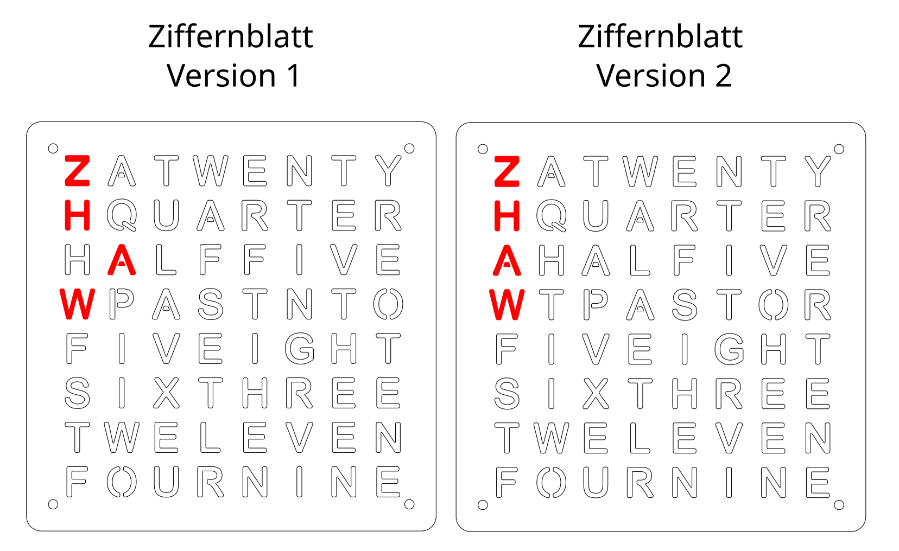

# Wortuhr Versionen
Es gibt zwei Versionen des Ziffernblatts:

Beim Verwenden von der Wortuhr muss daher die Version im Programm gewählt werden:     

WordClock(version=1) oder WordClock(version=2)
