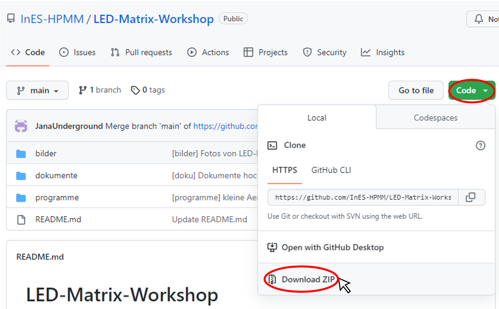
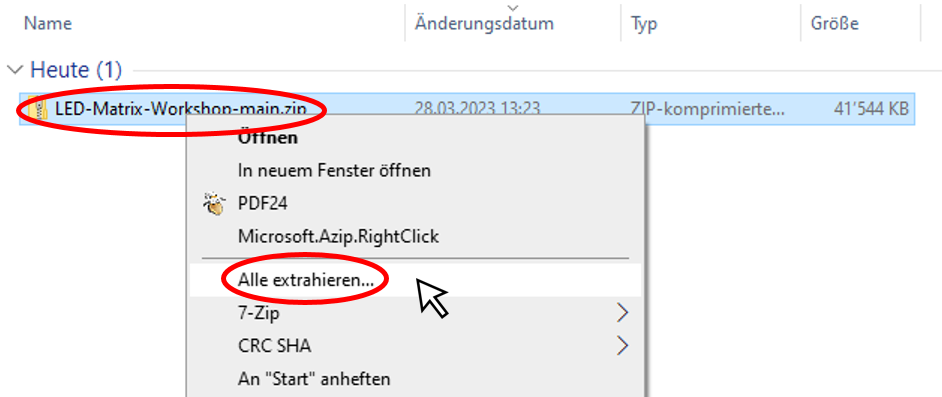
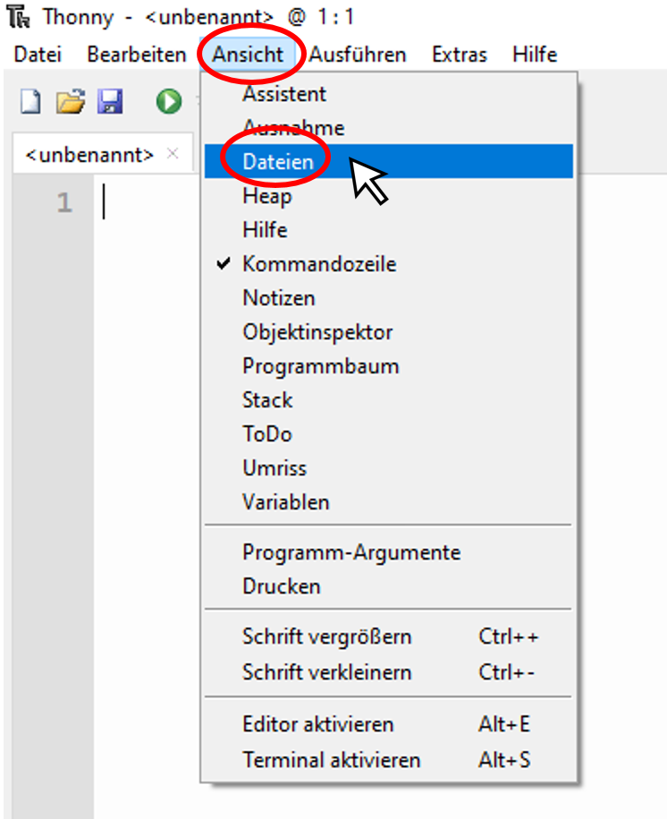
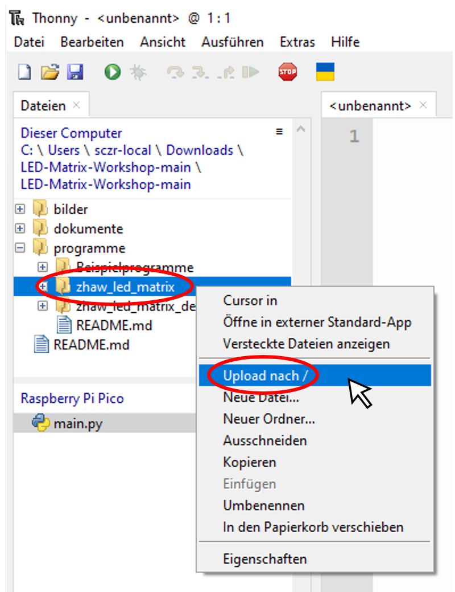

# Inhaltsverzeichnis
- [Ordnerstruktur](#ordnerstruktur)
- [Dateien herunterladen](#dateien-herunterladen)
- [**zhaw_led_matrix** Paket auf Pico laden](#paket-auf-pico)

# Ordnerstruktur
- **zhaw_led_matrix**: Dieser Ordner enthält mehrere Module mit Hilfsfunktionen für das Programmieren der LED-Matrix. Die Module sind zu einem Paket names *zhaw_led_matrix* zusammengefasst. Dieses Paket muss auf dem RaspberryPi Pico gespeichert werden, um Programme von dieser Website laufen lassen zu können.
- **zhaw_led_matrix_demo**: Enthält Demoprogramme welche zeigen, wie man die verschiedenen Module im zhaw_led_matrix Paket benutzt.
- **Beispielprogramme**: Enthält verschiedene Programme, welche du auf deiner LED-Matrix laufen lassen kannst (Wortuhr, Spiele, PixelArt, etc.)

# Dateien herunterladen
Auf der Startseite dieser Dateiablage (https://github.com/InES-HPMM/LED-Matrix-Workshop) können alle Dateien als Zip heruntergeladen werden. Klicke dafür auf den grünen Knopf **Code** und wähle **Download ZIP**.

Nach dem Herunterladen kann das Zip entpackt werden. Öffne dafür den Downloads Ordner, rechts klicke auf **LED-Matrix-Workshop-main.zip** und wähle **Alle extrahieren...**

# **zhaw_led_matrix** Paket auf RaspberryPi Pico laden
Um das **zhaw_led_matrix** Paket benutzen zu können, muss der Ordner auf den RaspberryPi Pico geladen werden. Dafür benutzen wir das Programm Thonny. Als erstes schalten wir die Dateien-Ansicht in Thonny ein. Klicke dafür in der oberen Menü-Leiste auf **Ansicht** und danach auf **Dateien**.

Die Anzeige **Dateien** zeigt die Dateien aus diesem Computer. Navigiere zum Ordner **zhaw_led_matrix**. Mit einem Rechtsklick auf den Ordner öffnet sich das Menü. Wähle **Upload nach /**. 

Jetzt ist der ganze Ordner auf dem RaspberryPi Pico gespeichert. Auf die gleiche Art kannst du auch andere Ordner oder einzelne Programme hochladen. Ab jetzt können auf dem Pico die Module vom **zhaw_led_matrix** Paket benutzt werden.